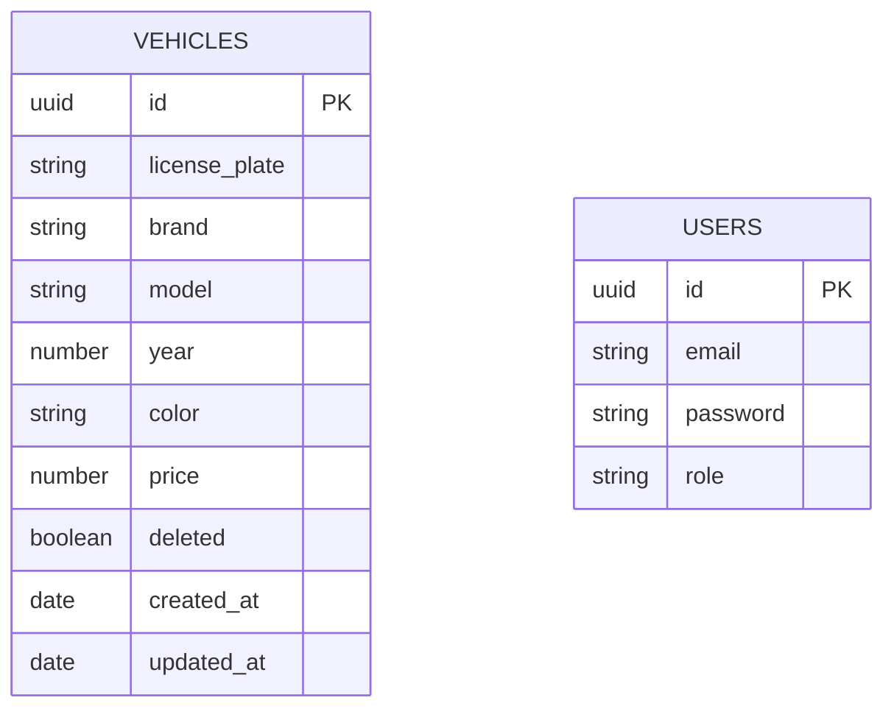
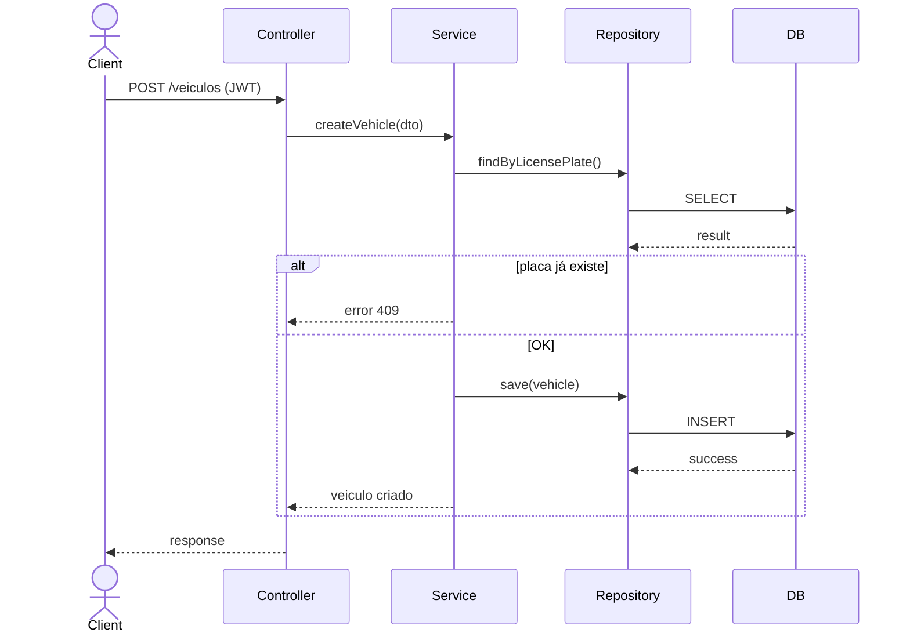
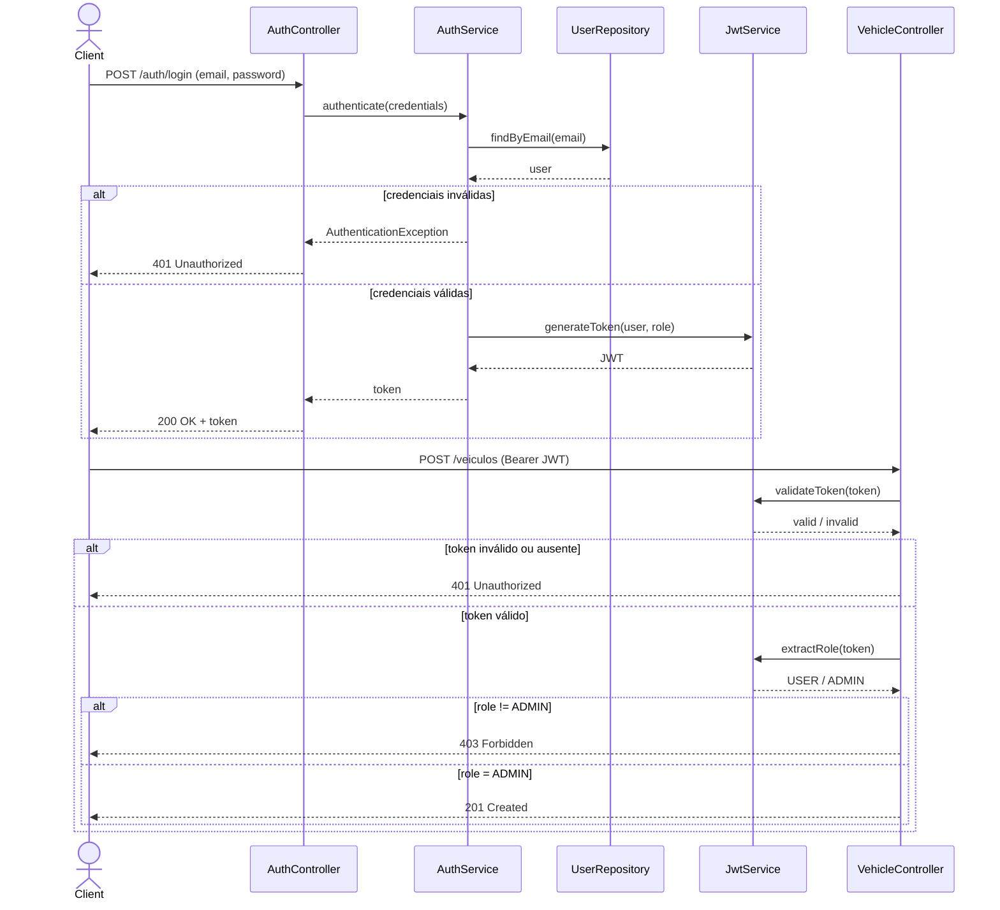

# Diagrama ER

```mermaid
    erDiagram
    VEHICLES {
        uuid id PK
        string license_plate
        string brand
        string model
        number year
        string color
        number price
        boolean deleted
        date created_at
        date updated_at
    }

    USERS {
        uuid id PK
        string email
        string password
        string role 
    }

```

# Diagrama de Sequencia

## Criação de veiculos

```mermaid
sequenceDiagram
    actor Client
    participant Controller
    participant Service
    participant Repository
    participant DB

    Client->>Controller: POST /veiculos (JWT)
    Controller->>Service: createVehicle(dto)

    Service->>Repository: findByLicensePlate()
    Repository->>DB: SELECT
    DB-->>Repository: result

    alt placa já existe
        Service-->>Controller: error 409
    else OK
        Service->>Repository: save(vehicle)
        Repository->>DB: INSERT
        DB-->>Repository: success
        Service-->>Controller: veiculo criado
    end

    Controller-->>Client: response
```

## Autenticação

```mermaid
sequenceDiagram
    actor Client
    participant AuthController
    participant AuthService
    participant UserRepository
    participant JwtService
    participant VehicleController

    Client->>AuthController: POST /auth/login (email, password)
    AuthController->>AuthService: authenticate(credentials)
    AuthService->>UserRepository: findByEmail(email)
    UserRepository-->>AuthService: user

    alt credenciais inválidas
        AuthService-->>AuthController: AuthenticationException
        AuthController-->>Client: 401 Unauthorized
    else credenciais válidas
        AuthService->>JwtService: generateToken(user, role)
        JwtService-->>AuthService: JWT
        AuthService-->>AuthController: token
        AuthController-->>Client: 200 OK + token
    end

    Client->>VehicleController: POST /veiculos (Bearer JWT)
    VehicleController->>JwtService: validateToken(token)
    JwtService-->>VehicleController: valid / invalid

    alt token inválido ou ausente
        VehicleController-->>Client: 401 Unauthorized
    else token válido
        VehicleController->>JwtService: extractRole(token)
        JwtService-->>VehicleController: USER / ADMIN

        alt role != ADMIN
            VehicleController-->>Client: 403 Forbidden
        else role = ADMIN
            VehicleController-->>Client: 201 Created
        end
    end
```