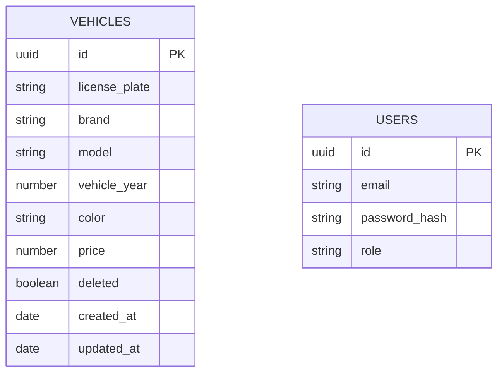
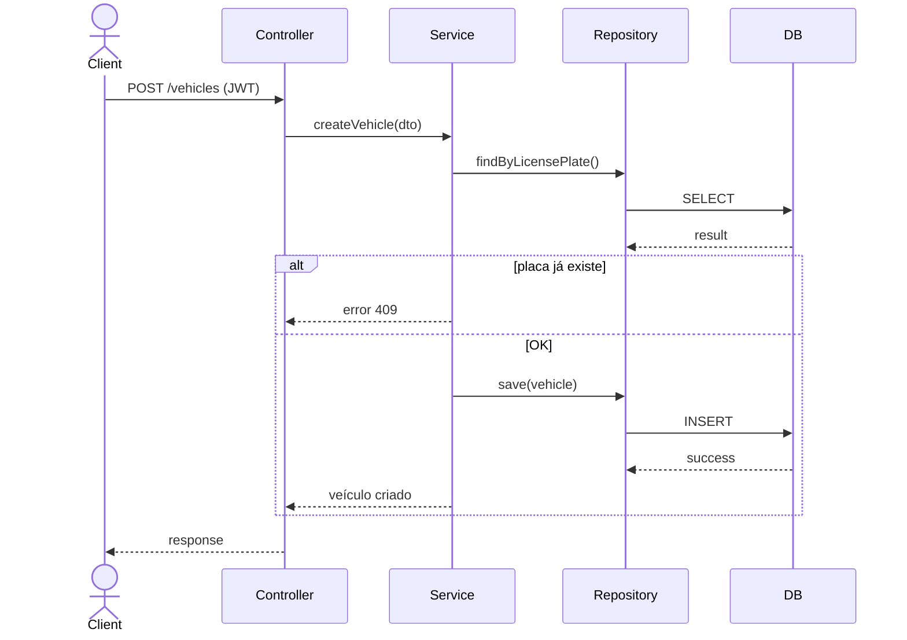
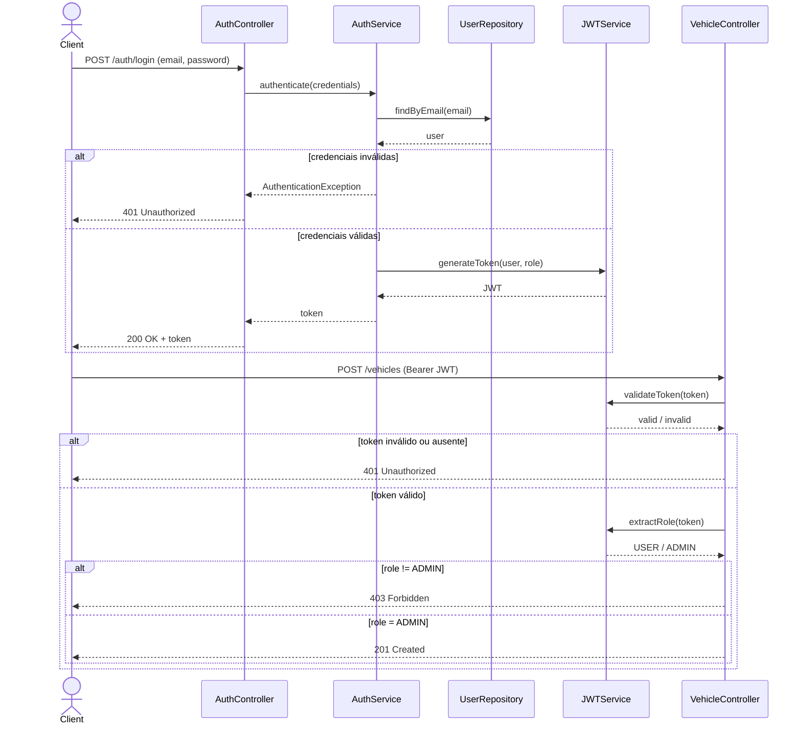

# API de Veículos

API REST desenvolvida em Java com Spring Boot para gerenciamento de veículos, com autenticação baseada em JWT e controle de acesso por perfil de usuário.

## Tecnologias utilizadas
- Java
- Spring Boot
- Spring Web
- Spring Security
- Spring Data JPA
- PostgreSQL
- Redis
- JWT
- MapStruct
- JUnit 5
- Mockito
- Docker Compose
- Swagger / OpenAPI


## Funcionalidades implementadas
- Veículos
- Cadastro de veículos
- istagem paginada
- Busca por ID
- Atualização completa
- Atualização parcial
- Remoção lógica (soft delete)
- Filtros dinâmicos com Specification
- Ordenação customizada
- Relatório por marca (GROUP BY)
- Conversão de moeda BRL → USD
- Cache da cotação do dólar com Redis
- Usuários e autenticação
- Criação de usuário
- Login com email e senha
- Geração de token JWT
- Controle de acesso por perfil:
- USER: apenas leitura (GET)
- ADMIN: acesso total (GET, POST, PUT, PATCH, DELETE)


## Arquitetura

O projeto segue uma arquitetura em camadas:

- controller
- service
- repository
- dto
- mapper
- specification
- security
- exception

## Padrões adotados
- DTOs separados por responsabilidade
- Validação de entrada
- Tratamento global de exceções
- Paginação padronizada
- Soft delete para veículos
- Normalização de dados
- Senha com hash usando BCrypt

## Segurança
- Autenticação via JWT Bearer Token
- Senhas armazenadas com hash
- Autorização baseada em roles (USER, ADMIN)
- Header de autenticação
- Authorization: Bearer <token>

Diagrama ER


Diagrama de Sequencia

Criação de veículos



Autenticação


## Como executar

### Pré-requisitos
* Java 17+
* Maven
* Docker
* Docker Compose

### Subir PostgreSQL e Redis
`docker-compose up -d`

O PostgreSQL e o Redis estão configurados no docker-compose.
A aplicação Spring Boot não está dockerizada e deve ser executada localmente.

### Rodar a aplicação
`mvn spring-boot:run`

### Configuração da aplicação

Exemplo de application.yml:

```
spring:
  datasource:
    url: jdbc:postgresql://localhost:5432/apiveiculos
    username: postgres
    password: postgres

  jpa:
    hibernate:
      ddl-auto: update

  data:
    redis:
      host: localhost
      port: 6379

jwt:
  secret: SUA_CHAVE_BASE64
  expiration: 86400000
```

### Documentação

Swagger disponível em: [http://localhost:8080/docs](http://localhost:8080/docs)

### Para testar endpoints protegidos:

Crie um usuário
Faça login em /auth/login
Copie o token retornado
Clique em Authorize no Swagger
Informe o token Bearer

### Endpoints principais
*Auth*
`POST /auth/login`
`Users`
`POST /users`

*Vehicles*
`GET /vehicles`
`GET /vehicles/{id}`
`POST /vehicles`
`PUT /vehicles/{id}`
`PATCH /vehicles/{id}`
`DELETE /vehicles/{id}`